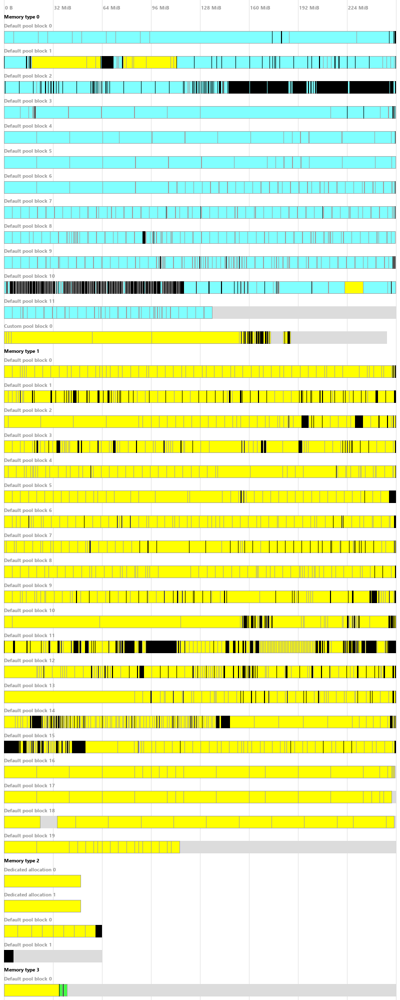

# VMA Dump Vis

Vulkan Memory Allocator Dump Visualization. It is an auxiliary tool that can visualize internal state of [Vulkan Memory Allocator](../../README.md) library on a picture. It is a Python script that must be launched from command line with appropriate parameters.

## Requirements

- Python 3 installed
- [Pillow](http://python-pillow.org/) - Python Imaging Library (Fork) installed

## Usage

```
python VmaDumpVis.py -o OUTPUT_FILE INPUT_FILE
```

* `INPUT_FILE` - path to source file to be read, containing dump of internal state of the VMA library in JSON format (encoding: UTF-8), generated using `vmaBuildStatsString()` function.
* `OUTPUT_FILE` - path to destination file to be written that will contain generated image. Image format is automatically recognized based on file extension. List of supported formats can be found [here](http://pillow.readthedocs.io/en/latest/handbook/image-file-formats.html) and includes: BMP, GIF, JPEG, PNG, TGA.

You can also use typical options:

* `-h` - to see help on command line syntax
* `-v` - to see program version number

## Example output



## Legend

*  Light gray without border - a space in Vulkan device memory block unused by any allocation.
*  Buffer with usage containing INDIRECT_BUFFER, VERTEX_BUFFER, or INDEX_BUFFER.
*  Buffer with usage containing STORAGE_BUFFER or STORAGE_TEXEL_BUFFER.
*  Buffer with usage containing UNIFORM_BUFFER or UNIFORM_TEXEL_BUFFER.
*  Other buffer.
*  Image with OPTIMAL tiling and usage containing DEPTH_STENCIL_ATTACHMENT.
*  Image with OPTIMAL tiling and usage containing INPUT_ATTACHMENT, TRANSIENT_ATTACHMENT, or COLOR_ATTACHMENT.
*  Image with OPTIMAL tiling and usage containing SAMPLED.
*  Other image with OPTIMAL tiling.
*  Image with LINEAR tiling.
*  Image with tiling unknown to the allocator.
*  Allocation of unknown type.
*  Black bar - one or more allocations of any kind too small to be visualized as filled rectangles.
